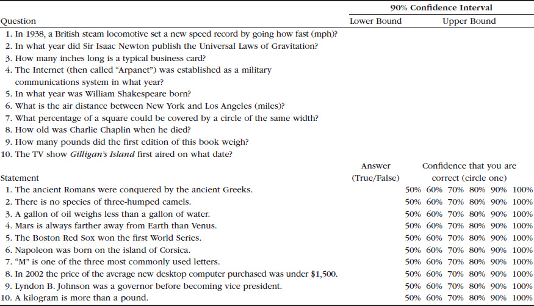
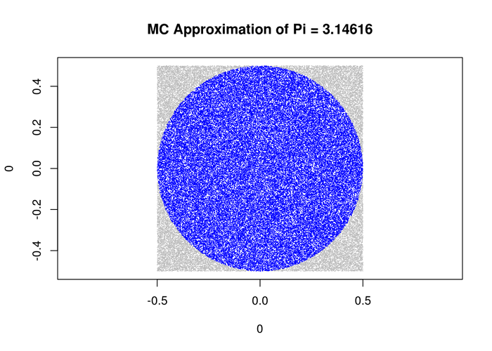
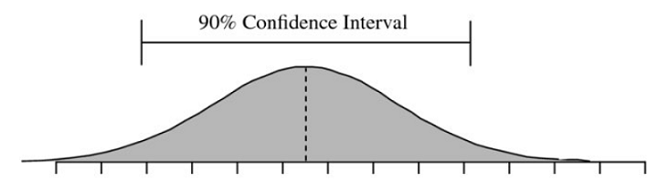
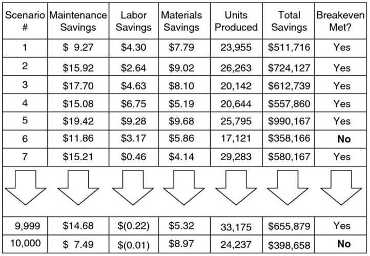
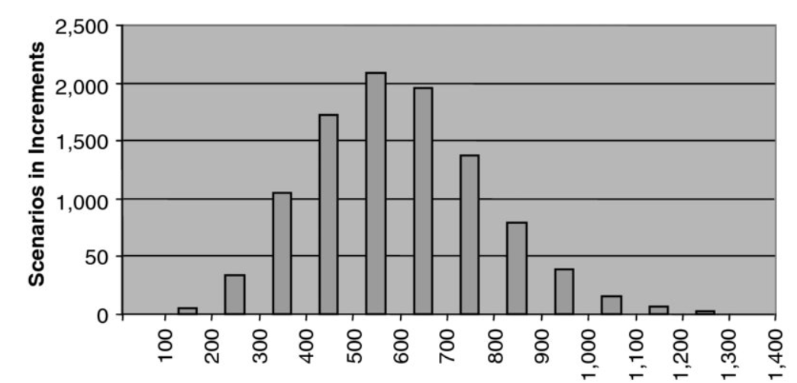
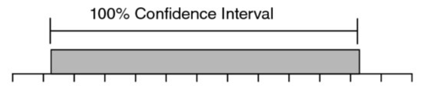

class: center, middle, inverse

# How to Measure Anything

## Finding the Value of Intangibles in Business

Jose Luis Domínguez

High quality minion on Payvison

@jlbalirac

---

class: inverse
# The book

### How to Measure Anything: Finding the Value of Intangibles in Business

Douglas W. Hubbard

President/CEO – Hubbard Decision Research

---
class: inverse
# The Challenge of Intangibles

### When you can measure what you are speaking about, and express it in numbers, you know something about it; but when you cannot express it in numbers, your knowledge is of a meager and unsatisfactory kind; it may be the beginning of knowledge, but you have scarcely in your thoughts advanced to the state of science.

    —Lord Kelvin (1824–1907), British physicist and member of the House of Lords
    
---

# The Challenge of Intangibles

--
* **Decision makers** usually have **imperfect information** (i.e., uncertainty) about the best choice for a decision.

--
*  These decisions should be **modeled quantitatively** because quantitative models have a favorable track record compared to **unaided expert** judgment.

--
*  Measurements **inform** uncertain decisions.

--
*  For any decision or set of decisions, there is a large combination of **things to measure** and **ways to measure** them—but perfect certainty is rarely a realistic option.
--
.boxed[
## In other words, we needs a method to analyze options for **reducing uncertainty** about **decisions**.
]
---

class: inverse
# An Intuitive Measurement Habit: Eratosthenes, Enrico, and Emily

Success is a function of persistence and doggedness and the willingness to work hard for
twenty-two minutes to make sense of something that most people would give up on after 
thirty seconds.

    —Malcolm Gladwell, Outliers: The Story of Success

---
# An Intuitive Measurement Habit: Eratosthenes, Enrico, and Emily
 
--
* In ancient Greece, a man **estimated** the circumference of Earth by **looking** at the lengths of shadows in different cities at noon and by applying some simple geometry.

--
* A Nobel Prize–winning physicist taught his students how to **estimate** values initially unknown to them like the number of piano tuners in Chicago.

--
* A nine-year-old girl **set up an experiment** that debunked the growing medical practice of “therapeutic touch” and, two years later, became the youngest person ever to be published in the Journal of the American Medical Association (JAMA).

---

# The Illusion of Intangibles: Why Immeasurables Aren’t
There are just three reasons why people think that something can’t be measured

--

- **Concept** of measurement. The definition of measurement itself is widely misunderstood. If one understands what “measurement” actually means, a lot more things become measurable.
--

- **Object** of measurement. The thing being measured is not well defined. Sloppy and ambiguous language gets in the way of measurement.
--

- **Methods** of measurement. Many procedures of empirical observation are not well known. If people were familiar with some of these basic methods, it would become apparent that many things thought to be immeasurable are not only measurable but may already have been measured.

---

# The Illusion of Intangibles: Why Immeasurables Aren’t
There are also three common reasons why something shouldn’t be measured. 

--

* The **economic** objection to measurement (i.e., any measurement would be too expensive).
--

* The **general** objection to the usefulness and meaningfulness of statistics (i.e., “You can prove anything with statistics”).
--

* The **ethical** objection (i.e., we shouldn’t measure it because it would be immoral to measure it).

---

# The Concept of Measurement
## Definition of Measurement

--
.boxed[
A .resaltar[quantitatively] expressed **reduction of uncertainty** based on one or more **observations**.    
]
---

# A Variety of Measurement Scales
.footnote[Stanley Smith Stevens wrote an article called “On the Theory of Scales and Measurement.”]

--
* **Nominal** measurements are simply “set membership” statements. Ejem  male or famele

--
* **Ordinal** scales, however, allow us to say one value is “more” than another, but not by how much. Ejem. 5 stars rating

--
*  **Interval**, the gaps between the numbers are comparable, Zero is relative. ºC

* **Ratio** can be added, subtracted, multiplied, and divided in a way that makes sense. Zero has meaning. ºK, money

---
# Bayesian Measurement: A Pragmatic Concept for Decisions

 The **Bayesians** were just explicitly **quantifying the initial state of uncertainty** and the **change** in uncertainty

.formula[$$ P(A \mid B) = \frac{P(B \mid A) \, P(A)}{P(B)} $$]

---
# The Object of Measurement

A problem well stated is a problem half solved.

    —Charles Kettering (1876–1958), American inventor, holder of 300 patents,
     including electrical ignition for automobiles

There is no greater impediment to the advancement of knowledge than the ambiguity of words.

    —Thomas Reid (1710–1769), Scottish philosopher

.boxed[
    If someone asks how to measure **strategic alignment** or **flexibility** or **customer satisfaction,** I simply ask: **What do you mean**, exactly?
]
---
# Clarification Chain

--
* If it **matters** at all, it is **detectable**, observable.

--
* If it is **detectable**, it can be detected as an **amount** (or range of possible amounts).

--
* If it can be **detected** as a range of possible amounts, it can be **measured**.

---
# The Methods of Measurement

 If you measure the length of a table or if you measure the time spent to resolve a particular client problem at a call center, there is no larger “unseen” population you are trying to assess. You have **direct access** to the entire **object of measurement**.
 
--
.boxed[
 Most of the apparently **difficult** measurements, however, involve **indirect deductions and inferences**. We need to infer something `unseen` from something `seen`.
]

---
# Measurement methods

--
* Measuring with very small random samples of a very large population

--
* Measuring the size of a mostly unseen population

--
* Measuring when many other, even unknown, variables are involved

--
* Measuring the risk of rare events

--
* Measuring subjective preferences and values

---
# Rule of five

Company Size: 10.000

Commuting sample: [30, 60, 45, 80, 60] 

--
.boxed[
What the chance is that the **median** of the population is between the highest and lowest values in the sample of five **(30 and 80)**
]

---
class: center, middle, inverse
# .big[93.75%]

.footnote[Remember, the median is the point where half the population is above it and half is below it]

---
# Even Smaller Samples: The Urn of Mystery

Boxes: 100.000.000.

Balls per box: 1000,

with randow colors green or red

.boxed[
    If I can pick **1 ball** from a box, what are my chances to guest right?]

---
class: center, middle, inverse
# .big[75%]

--
.boxed[
### The Single Sample Majority Rule 
.left[
Given maximum uncertainty about a population proportion—such that you believe the proportion could be anything between 0% and 100% with all values being equally likely—there is a 75% chance that a single randomly selected sample is from the majority of the population.]
]

---
# Our Small-Sample Intuition versus Math

Our thesis is that people have **strong intuitions** about random sampling; that these intuitions **are wrong** in fundamental respects; that these intuitions are shared by naive subjects and by trained scientists; and that they are applied with unfortunate consequences in the course of scientific inquiry.

    —Kahneman, Tversky

---
class:  middle, inverse,  justify
# Are you trying to get published in a peer-reviewed journal, or are you just trying to **reduce your uncertainty** about a **real-life** business decision?

---
class:  middle, inverse, center

# Clarifying the Measurement Problem

---
# Prior to measure

--
* **What is the decision** this measurement is supposed to support?

--
* What is the **definition** of the thing being measured in terms of **observable consequences** and how, exactly, does this thing matter to the decision being asked?

--
* **How much do you know about** it now

--
* How does **uncertainty** about this variable **create risk** for the decision?

--
* What is the value of **additional information**?

---

# Toward a Universal Approach to Measurement

--
1.  Define a **decision problem** and the relevant uncertainties. **What is your dilemmma?**

--
1. Determine what you know **now**. This is done by learning how to describe your uncertainty in terms of **ranges and probabilities**. 

--
1.  Compute the value of **additional information**. 
    
    If there are no variables with information values that justify the cost of any measurement approaches, skip to step 5.

--
1. Apply the **relevant** measurement instrument(s) to **high-value** measurements. 
   
   Repeat 3

--
1. Make a **decision** and **act** on it
   
   Repeat 1

---
class: inverse,middle,center
# Dashboards and Decisions: Do They Go Together?

--
## A dashboard can definitely be a very powerful tool.

--
## It is also routinely a wasted resource.

--
.boxed[
    The data on the dashboard was **usually not selected** with specific **decisions** in mind based on specific conditions for **action**
]

---
class: inverse, middle

.boxed.justify[
We discovered that it was difficult for researchers to think about measurements in terms of **specific decisions** their research would support and the specifics of alternative interventions that they might recommend. Previously, research managers would urge researchers to identify which variables they should be measuring **to track progress** towards achieving development goals, but without reference to any specific decision. They are used to thinking about **how to measure quantities of interest, but not why**.
    
    Dr. Shepherd
]

---
# Requirements for a Decision

--
* A decision has two or more **realistic alternatives**. 

--
* A decision has **uncertainty**. _There have to be two or more choices and the best choice is not certain_.

--
* A decision has potentially **negative consequences** if it turns out you took the wrong position.

--
* A decision has a **decision maker**. 

---
# Potential Forms of a Decision

--
* A decision can be **one big** thing or **many little** things.

--
* A decision can be about a **discrete** or **continuous** choice.

--
* Decisions can be with **one or many** stakeholders including **collaborating and/or competing** parties.

---
# If You Understand It, You Can Model It
A decision has to be defined well enough to be modeled quantitatively.
.boxed[
## A Ridiculously Simple (But Completely Legitimate) Decision Model

* Estimated Costs of Action X.
* Estimated Benefits of Action X.
* If Benefits of Action X exceed Costs of Action X, execute Action X.

(Now just decompose costs and benefits into more detail as needed.)
]

---
class: inverse, middle, justify
# Essentially, all models are **wrong**, but some are **useful**.

    George Box 

---
# Definitions for Uncertainty, Risk, and Their Measurements

--
* **Uncertainty**: The **lack** of complete certainty, that is, the existence of more than one possibility. The “true” outcome/state/result/value is not known.

--
* **Measurement of Uncertainty**: A set of **probabilities** assigned to a set of possibilities. For example: “There is a 60% chance this market will more than double in five years, a 30% chance it will grow at a slower rate, and a 10% chance the market will shrink in the same period.”

--
* **Risk**: A state of uncertainty where some of the **possibilities** involve a loss, catastrophe, or other **undesirable outcome**.

--
* **Measurement of Risk**: A set of **possibilities** each with **quantified probabilities** and **quantified losses**. For example: “We believe there is a 40% chance the proposed oil well will be dry with a loss of $12 million in exploratory drilling costs.”

---

# An Example of a Clarified Decision

---
class: inverse, middle, center
.big[
    IT Security
]
---
class: center, middle
# What is IT Security

---
## Security Systems
* Public Key Infrastructure (key encryption/ decryption, etc.)
* Biometric/single sign-on (fingerprint readers, security card readers, etc.)
* Intrusion-detection systems
* Security-compliance ertification program for new systems
* New antivirus software
* Security incident reporting system
* Additional security training

---
## Events Averted or Reduced
* Pandemic virus  attacks
* Unauthorizedsystem access: external (hackers) or internal (employees)
* Unauthorized physical access to facilities or property
* Other disasters: fire, flood, tornado,etc. 	

---
## Costs Averted
* Productivity losses
* Fraud losses
* Legal liability/improper disclosure
* Interference with mission

---
# Estimates for the Effects of Virus Attacks
* Agency-wide virus attacks per year (for the next five years) 	**2-4**
* Average number of people affected **25,000-65,000**
* Percentage productivity loss **15%-60%**
* Average duration of productivity loss **4 hours-12 hours**
* Loaded annual cost per person (most affected staff would be in the lower pay scales) **$50,000-$100,000**

.footNote[The values is 90% likely to fall between or be equal to these points]

---
class: inverse, middle, center
#Calibrated Estimates: How Much Do You Know Now?

--
.boxed.justify[
## The most important questions of life are indeed, for the most part, really only problems of probability.
    —Pierre Simon Laplace, Théorie Analytique des Probabilités, 1812
]

---
## Two Extremes of Subjective Confidence
.boxed[
**Overconfidence**: When an individual routinely overstates knowledge and is correct less often than he or she expects. For example, when asked to make estimates with a 90% confidence interval, far fewer than 90% of the true answers fall within the estimated ranges.

**Underconfidence**: When an individual routinely understates knowledge and is correct much more often than he or she expects. For example, when asked to make estimates with a 90% confidence interval, far more than 90% of the true answers fall within the estimated ranges.
]

---
class: center

 

---
# Further Improvements on Calibration

.boxed.justify[
    The academic research so far indicates that **training** has a **significant effect** on calibration]

---
class: inverse, center , middle
# Quantifying Risk through Modeling

--
.boxed.justify[
## It is better to be approximately right than to be precisely wrong.

    —Warren Buffett]

---
class: inverse, center, middle

.formula[$$ uncertainty \neq risk $$]

---
# How Not to Quantify Risk
* Many organizations simply say a risk is **high**, **medium**, or **low**.
* Scale of **1** to **5**. 

---
# Real Risk Analysis: The Monte Carlo

.center[ ]

---
# An Example of the Monte Carlo Method and Risk

## Leasing a new machine $400,000/year

* Maintenance savings (MS): $10 to $20 per unit
* Labor savings (LS): –$2 to $8 per unit (note the negative lower bound)
* Raw materials savings (RMS): $3 to $9 per unit
* Production level (PL): 15,000 to 35,000 units per year
* Annual lease (breakeven): $400,000

---
class: center
# Now you compute your annual savings very simply as:
$$ Annual Savings = (MS + LS + RMS) × PL $$
.justify[
If we just take the midpoint of each of these ranges, we get:

$$ Annual savings = ($15 + $3 + $6) × 25,000 = $600,000 $$
]

---
# Normal distribution
.center[ ]

--
* Values in the middle are more likely that values farther away

--
* The distribution is simetrical

--
* Ther is no hard stop

$$ = norminv(rand(), mean, standar desviation) $$

---
# Simulation
.center[]

---
# Histogram
.center[]

---
# Results
* **14%** of the results were less than the $400,000
* There is a **3.5%** chance that the factory will lose more than **$100,000** per year

---
# A shortcut can apply in some situations. If we had all normal distributions 

$$ interval= \sqrt{\sum(max - med)^2} $$
$$ interval= \sqrt59 $$
$$ interval = $7.68 $$
$$ Total up the means: $15 + $3 + $6= $24 $$

So the 90% CI for the sum of all three 90% CIs for maintenance, labor, and materials is **$16.32** to **$31.68**.

**Optimistic** values for an upper bound and **pessimistic** values for the lower bound. This would result in a range of **$11** to **$37** 

---
# Lets add some binary event to our model

.boxed.justify[
    What if there was a **10%** chance of a loss of a major account that would, by itself, **drop the demand** (and therefore the production levels) by 1,000 units per month (i.e., **12,000** units per year)?
]

$$ PLw \mid contract loss = PLnormal − 1,000 units × (Contract Loss × Month Remaining) $$

---
# Uniform distibution
.center[ ]

--
* All values between the bounds are equally likely

--
* The distribution is simetrical

--
* Ther is hard stop

--

$$ = rand()*(UB-LB)+LB $$

---
# Advance topics
* More distributions
* Correlations
* Markov simulations
* Agent simulations

---
class: inverse, middle

.boxed[
# Risk Paradox

If an organization uses quantitative risk analysis at all, it is usually for routine operational decisions. The largest, most risky decisions get the least amount of proper risk analysis.
]

---
class: inverse, middle, center
# Quantifying the Value of information 